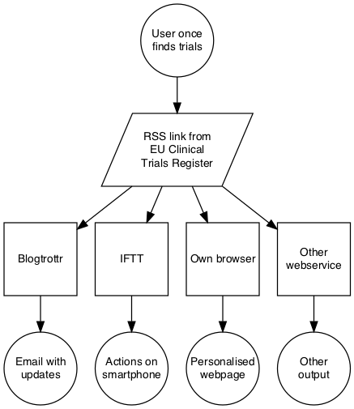

# README.md for github repository euctrnotifications

The purpose of this repository is to provide a description how a user can set up personalised notifications to automatically obtain updates on clinical trials of interest, using a variety of services on the internet. 

- The permanent link to this documentation is [https://github.com/rfhb/euctrnotifications/master/howto.html](https://github.com/rfhb/euctrnotifications/master/howto.html).

- A docx document is here: [https://rawgit.com/rfhb/euctrnotifications/master/howto.docx](https://rawgit.com/rfhb/euctrnotifications/master/howto.docx).

For suggestions, comments and queries please click [here](https://github.com/rfhb/euctrnotifications/issues), where you can search for an issue or open a new issue.  

