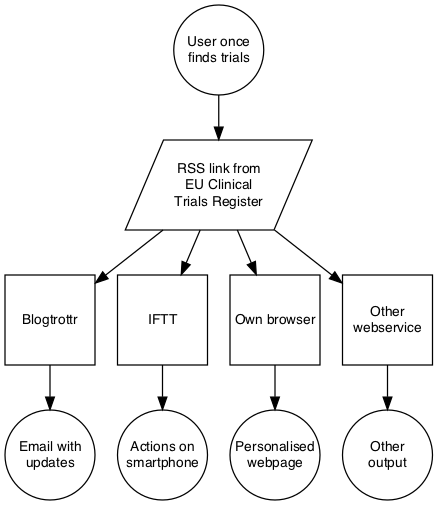
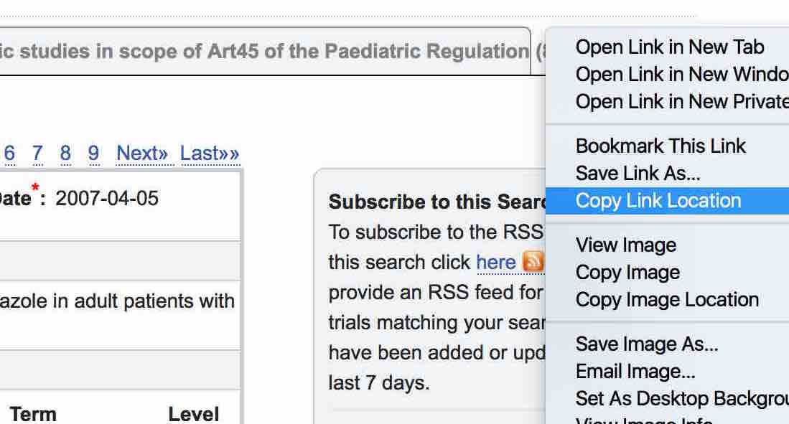
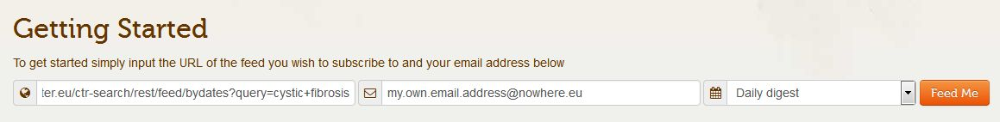
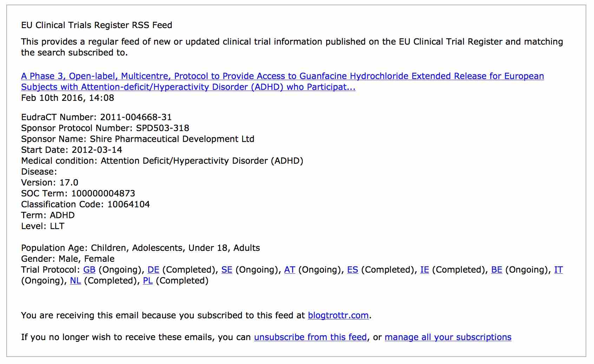
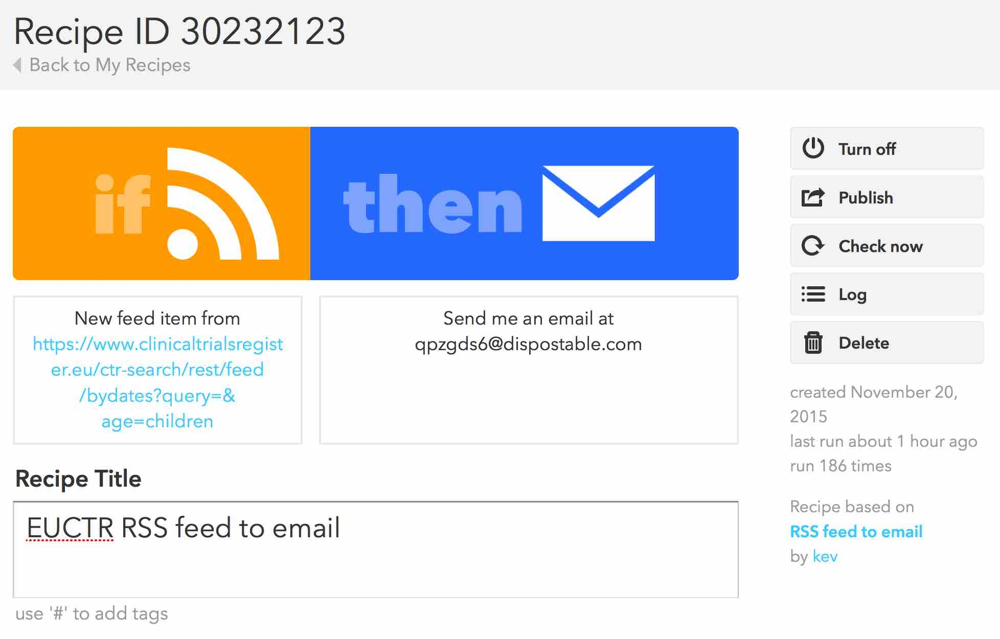
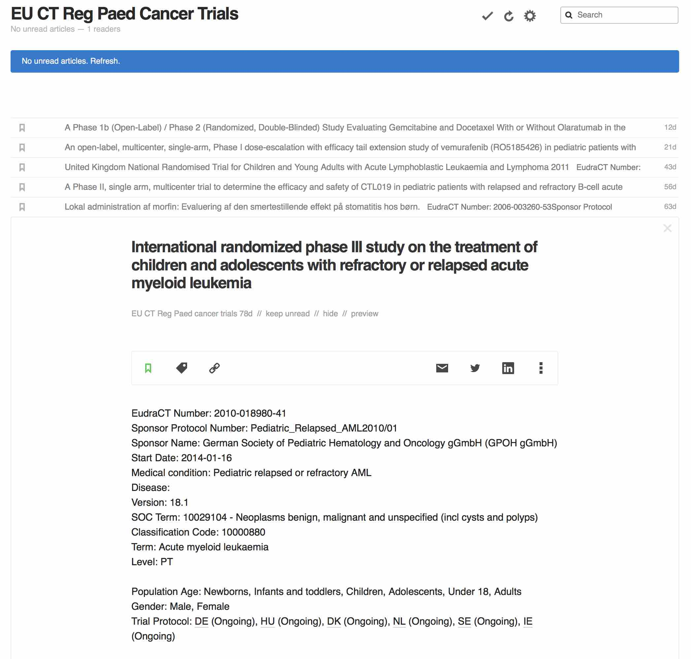
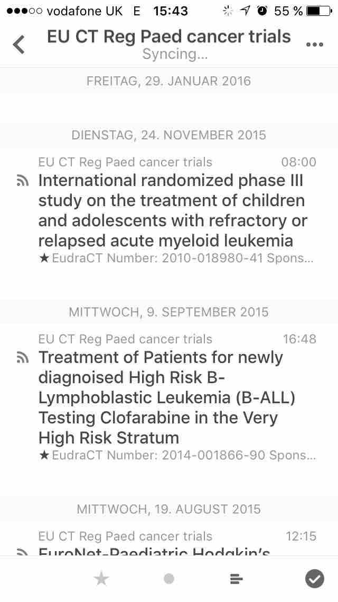

```{r setup, include=FALSE}
#
knitr::opts_chunk$set(echo = FALSE)
#
if(interactive()) {
  httr::set_config (use_proxy ("myproxyhere", 8080))
  devtools::install_github("rich-iannone/DiagrammeR")
  devtools::install_github('rich-iannone/DiagrammeRsvg')
}
#
# command line set up:
# git config --global credential.helper wincred
# git remote add origin https://github.com/rfhb/euctrnotifications.git
# git pull -u origin master
# git push -u origin master
```

# Objective and feedback

The purpose of this document is to describe how a user can set up personalised notifications to automatically obtain updates on clinical trials of interest. This is based on protocol-related information that is made publicly available in the EU Clinical Trials Register [EUCTR](https://www.clinicaltrialsregister.eu/). The licence of this document (Apache 2.0) can be found [here](https://github.com/rfhb/euctrnotifications/blob/master/LICENSE).

The permanent link to this document is [https://rawgit.com/rfhb/euctrnotifications/master/howto.html](https://rawgit.com/rfhb/euctrnotifications/master/howto.html).

Suggestions, comments and queries concerning this how-to are welcome. Please click [here](https://github.com/rfhb/euctrnotifications/issues), where you can search for an issue or open a new issue. The author will be automatically informed. 


# Overview

```{r overviewdiagram, include=FALSE}
suppressWarnings({
  # to avoid cluttering the rendered document
  library(DiagrammeR)
  # library(DiagrammeRsvg)
})

# implementation changed to save bitmapped format 
# in order to improve compatibilty with old browsers

nodes <- create_nodes(
  nodes = c("euctr", "bt", "iftt", "other", 
            "email", "action", "page", "outp", 
            "query"),
  label =   c(
    "EU Clinical\nTrials Register", "Blogtrottr", "IFTT", "Other\nwebservice", 
    "Email with\nupdates","Actions on\nsmartphone","Personalised\nwebpage","Other\noutput",
    "User once\nfinds trials"),
  shape = c("parallelogram", "rectangle", "rectangle", "rectangle", 
            "circle", "circle", "circle", "circle",  
            "circle"),
  width = c (2, 1, 1, 1, 1, 1, 1, 1, 1)
)

edges <- create_edges(
  from = c("query", "euctr", "euctr", "euctr", "euctr", "bt", "iftt", "other"),
  to =   c("euctr", "bt", "iftt", "other", "page", "email", "action", "outp"),
  rel = "leading_to"
  )

graph <- create_graph(
  nodes_df = nodes,
  edges_df = edges,
  node_attrs = "fontname = Helvetica, fontsize = 12, fixedsize = true, height = 1",
  edge_attrs = c("arrowsize = 1")
  )

if(interactive())grViz(graph$dot_code)

export_graph(graph, file_name = "overview1.png")

```

This diagramme is meant to indicate the steps (from top to bottom) and notifications options (squares) described in this document. 

# Setting up notifications - step by step

## 1. User once defines relevant trials

- Do a search in the EU Clinical Trials Register, start [here](https://www.clinicaltrialsregister.eu/ctr-search/search). Refine the search until search parameters find relevant trials. 

- In the grey box on the right hand side, do a secondary (right) mouse click on the word "here" in the sentence "To subscribe to the RSS feed for this search click here". Then click on "Copy Link Location" (or corresponding item) as shown in screenshot below. 

- The clipboard of the computer now contains the link to a newsfeed for this search. It will be used in the next steps. Example: https://www.clinicaltrialsregister.eu/ctr-search/rest/feed/bydates?query=cystic+fibrosis. 

## 2. User once configures a notification system (a, b or c)

The following three approaches are *alternatives* for how users can select and configure how they want to be notified. 

### a. Email with updates

These notifications are based on services on the internet that offer to generate emails from a newsfeed such as prepared in step 1. There are a number of such services on the internet, some are free and some do not require registration. Such a free service is used here to exemplify the principle but others can be used; this example does not imply any recommendation. 

- Open the start page of [Blogtrottr](https://blogtrottr.com/). 

- Where it reads "http://", paste the content of the clipboard; this replaces all text with the link to the newsfeed generated in the step 1. 

- Add the email address to which the notification should be sent. 

- Chose the time interval for notifications (set to daily in the example screenshort below). 

- Click on "Feed Me" and note the confirmation box. 

- To control (stop / unsubscribe or change / manage) the notifications, click the relevant link at the bottom of every email from this service. An example is the following screenshot. 


### b. Actions on smartphone

For more sophisticated control and personal user experience, other services on the internet can be used, such as [IFTTT](https://ifttt.com/) which allows to trigger a range of complex actions on different devices. However, this service also can send emails in the same way as described above, and this is shown in this step as a minimalistic example. This service is used for the example here; note it requires registration. 

- Open the start page of [IFTTT](https://ifttt.com/) and sign in or sign up, if not yet registered. 

- Click on "Create Recipe". Click on "this". Scroll down and chose trigger channel "Feed". Click on "New feed item". Paste the contents of the clipboard from step 1. into the box "Feed URL". Click on "Create Trigger". 

- Click on "that". Find and chose action "Email". Click on "Create Action". Click on "Create Recipe". Many other actions are offered by this service such as adding notificatiosn to the iOS Reminders app on a user's smart phone. An overview of this simple example is in the screenshot below. 


### c. Personalised webpage use

The link to the newsfeed created in step 1 can also be used as follows with other services on the internet, for example: 

- It can be added to a browser-based newsreader such as [feedly](https://feedly.com/i/latest), see following screenshot. 

- It can be added to news apps such as Reeder, see following screenshot. { width=30% }

End.

